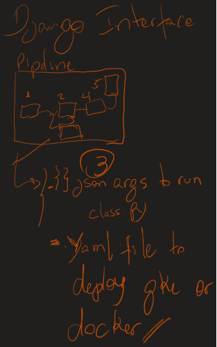

# Jabuticaba: Framework para pipelines de dados e ml.

## About Jabuticaba
  

The jabuticaba project is a framework for developing and running machine learning project pipelines.
currently contains 3 classes that do data preparation and splitting, and a class with a machine learning model, all of which use a helper class to manipulate the data during the pipeline.
The objective of the project is to extend these classes so that they can be exported as containers with independent execution.
each class is instantiated as a pipeline object and can be constructed with a .json file containing the construction and execution parameters of this object.

O projeto jabuticaba é um framework para desenvolvimento e execução de pipelines de projetos de machine learning. Atualmente contém 3 classes que fazem preparação e divisão de dados e uma classe com um modelo de aprendizado de máquina do pacote scikit learning, todas usando uma classe auxiliar DataHandler para manipular os dados durante o pipeline. O objetivo do projeto é estender essas classes para que possam ser exportadas como containers com execução independente. Cada classe é instanciada como um objeto de pipeline e pode ser construída com um arquivo .json contendo os parâmetros de construção.

## Factory Method para DataPrep e DataSplit
- [Factory Method](./src/README.md)  

- [DataPrep/Split](./src/steps/README.md)  

## Classes ML (execucao sem factory method)  

- [DataPrep/Split](./src/mlUtils/README.md)
