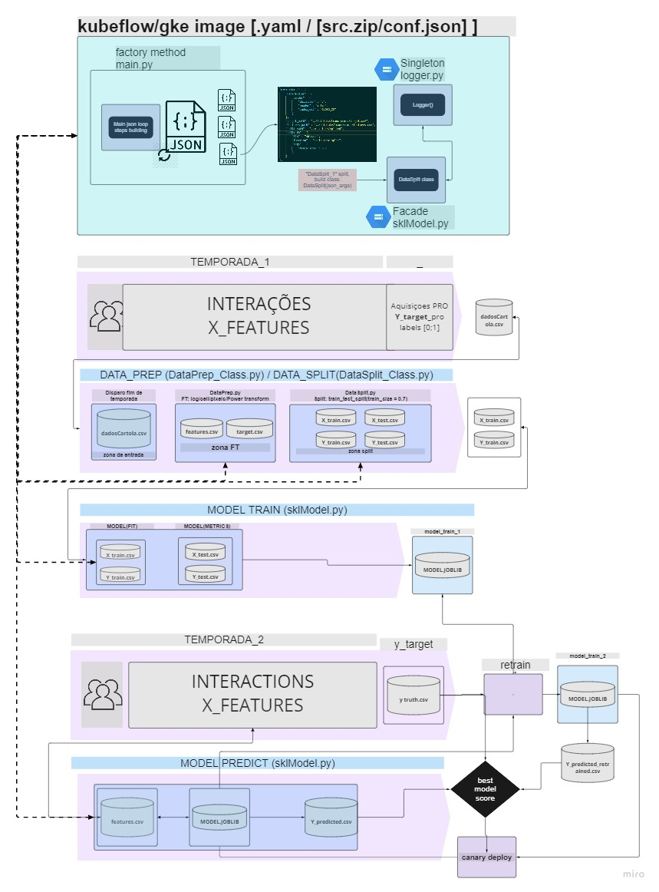

# DIAGRAMA PARA EXECUÇÃO ON-PREMISSE / GKE



DATAPREP / TRANSFORMACAO -> executar main.py 
python ./Src/main.py (carrega json default de configuracoes de pre-processamento)
    opcional -> conf=./confs/DataPrep_1.json ou conf=./confs/DataSplit_1.json

TREINO
    pyhon ./Src/mlUtils/sklModel.py 
        --path (obrigatorio para informar dados de exportacao do modelo)
        --train (obrigatorio para informar pasta com dados de treino)

PREDICAO
    pyhon ./Src/mlUtils/sklModel.py 
        --path (obrigatorio para informar dados de exportacao do modelo)
        --predict (obrigatorio para informar caminho do arquivo X_predict já pre-processado, deve ser compativel com leitura pandas)

#############################
EXEMPLOS DE EXECUCOES

PRE PROCESSAMENTO E TRANSFORMACOES (EXECUTAR NA RAIZ DO MAIN.PY)
(datascience) PS C:\Users\douglas.diniz.landim\OneDrive - Accenture\Documents\Desafio_Eng_ML\Project\Src> python main.py
    --conf = *.json (arquivo de configurações dos steps de dataprep e data split, carrega .\confs\default.json se nao informado)

#############################
TREINO
```
(datascience) PS C:\Users\douglas.diniz.landim\OneDrive - Accenture\Documents\Desafio_Eng_ML\Project> python .\Src\mlUtils\sklModel.py --path=".\Models\sklModel\" --train=".\Datalake\splited\20220609112022\"
-- Epoch 1
Norm: 5.25, NNZs: 28, Bias: 0.016876, T: 62558, Avg. loss: 1.373613
Total training time: 0.02 seconds.
-- Epoch 2
Norm: 3.88, NNZs: 28, Bias: 0.839543, T: 125116, Avg. loss: 0.340952
Total training time: 0.12 seconds.
-- Epoch 3
Norm: 3.62, NNZs: 28, Bias: 0.331054, T: 187674, Avg. loss: 0.297091
Total training time: 0.20 seconds.
-- Epoch 4
Norm: 3.03, NNZs: 28, Bias: 0.338396, T: 250232, Avg. loss: 0.283985
Total training time: 0.26 seconds.
-- Epoch 5
Norm: 2.96, NNZs: 28, Bias: 0.253536, T: 312790, Avg. loss: 0.276284
Total training time: 0.33 seconds.
-- Epoch 6
Norm: 3.04, NNZs: 28, Bias: 0.365937, T: 375348, Avg. loss: 0.272332
Total training time: 0.39 seconds.
Convergence after 6 epochs took 0.41 seconds

SCORE : 0.8450994726123963


Saving sklModel object .\Models\sklModel\20220609130533_sklModelObj.joblib


Saving sckitlearn Pipe object .\Models\sklModel\20220609130533_pipeModel.joblib

```
#############################

PREDICAO
```
python .\Src\mlUtils\sklModel.py --path=".\Models\sklModel\propension_model_new.joblib" --predict=".\Datalake\splited\20220609112022\X_test.csv" --threshold=0.75
(datascience) PS C:\Users\douglas.diniz.landim\OneDrive - Accenture\Documents\Desafio_Eng_ML\Project> python .\Src\mlUtils\sklModel.py --path=".\Models\sklModel\propension_model_new.joblib" --predict=".\Datalake\splited\20220609112022\X_test.csv" --threshold=0.75
PIPE LOADED
Pipeline(steps=[('imputer', SimpleImputer(strategy='median')),
                ('center', PowerTransformer()),
                ('sgd',
                 SGDClassifier(early_stopping=True, loss='log',
                               validation_fraction=0.3, verbose=5))])
X DataFrame Loaded
          anos_desde_criacao  anos_como_pro   rel_pont    rel_pat  totals  max_camp  escalacoes  ...  instagram_num_stdpt  min_camp_stdpt  ceil_avg_3  ceil_avg_4  avg_3_stdpt  avg_4_stdpt  total_pixels_stdpt
GLOBO_ID                                                                                         ...
239139                     0              0  -3.272647 -18.974226       0   6060297    1.558824  ...            -0.881223        1.422203    0.000000    0.000000    -1.467764    -0.726917                 NaN
158350                     3              0   7.516068 -10.722622       0   2266488    5.289474  ...            -0.881223       -0.079643    1.000000    0.000000    -0.070251    -0.726917                 NaN
165711                     4              1 -13.038736 -22.578901       0   5296777    0.027027  ...            -0.881223        1.535761    0.000000    0.000000    -1.467764    -0.726917                 NaN
220455                     6              0  21.087910  46.846326       0   1317334    3.421053  ...            -0.881223       -1.310844    0.894737    0.394737    -0.167745     1.285624                 NaN
227360                     3              0  14.199226  -0.626569       0   3743108    3.210526  ...             1.219574       -0.281376    0.000000    0.000000    -1.467764    -0.726917                 NaN

[5 rows x 28 columns]

Predicted head
   target_pro_proba  threshold  target_pro
0          0.046695       0.75       False
1          0.366333       0.75       False
2          0.824646       0.75        True
3          0.634890       0.75       False
4          0.152203       0.75       False

Saving sklModel object .\Models\sklModel\20220609130719_propension_model_new.joblib

Saving sckitlearn Pipe object .\Models\sklModel\20220609130719_pipeModel.joblib

Saving predicted DF to .\Datalake\splited\20220609112022\X_test_y_predicted.csv

```
### PRE PROCESSAMENTO E TRANSFORMACOES (EXECUTAR NA RAIZ DO MAIN.PY)
```
(datascience) PS C:\Users\douglas.diniz.landim\OneDrive - Accenture\Documents\Desafio_Eng_ML\Project\Src> python main.py
Default conf file loaded
INFO:Desafio_Eng_ML
:Default conf file loaded
running step : DataPrep_1
INFO:Desafio_Eng_ML
:running step : DataPrep_1
call_1
INFO:Desafio_Eng_ML
:call_1
 Applying get_long_tail to column anos_desde_criacao as log_anos_desde_criacao
INFO:Desafio_Eng_ML
: Applying get_long_tail to column anos_desde_criacao as log_anos_desde_criacao
 Applying get_long_tail to column instagram_num as log_instagram_num
INFO:Desafio_Eng_ML
: Applying get_long_tail to column instagram_num as log_instagram_num
 Applying get_long_tail to column facebook_num as log_facebook_num
INFO:Desafio_Eng_ML
: Applying get_long_tail to column facebook_num as log_facebook_num
 Applying get_long_tail to column min_camp as log_min_camp
INFO:Desafio_Eng_ML
: Applying get_long_tail to column min_camp as log_min_camp
 Applying get_long_tail to column interacoes_g1 as log_interacoes_g1
INFO:Desafio_Eng_ML
: Applying get_long_tail to column interacoes_g1 as log_interacoes_g1
 Applying get_long_tail to column tempo_desperd as log_tempo_desperd
INFO:Desafio_Eng_ML
: Applying get_long_tail to column tempo_desperd as log_tempo_desperd
 Applying get_long_tail to column iteracao_volei as log_iteracao_volei
INFO:Desafio_Eng_ML
: Applying get_long_tail to column iteracao_volei as log_iteracao_volei
 Applying get_long_tail to column iteracao_atletismo as log_iteracao_atletismo
INFO:Desafio_Eng_ML
: Applying get_long_tail to column iteracao_atletismo as log_iteracao_atletismo
call_2
INFO:Desafio_Eng_ML
:call_2
 Applying get_total_pixels to column pixels as total_pixels
INFO:Desafio_Eng_ML
: Applying get_total_pixels to column pixels as total_pixels
call_3
INFO:Desafio_Eng_ML
:call_3
 Applying ceil to column avg_3 as ceil_avg_3
INFO:Desafio_Eng_ML
: Applying ceil to column avg_3 as ceil_avg_3
 Applying ceil to column avg_4 as ceil_avg_4
INFO:Desafio_Eng_ML
: Applying ceil to column avg_4 as ceil_avg_4
['pro_target', 'anos_desde_criacao', 'instagram_num', 'facebook_num', 'min_camp', 'interacoes_g1', 'tempo_desperd', 'iteracao_volei', 'iteracao_atletismo', 'pixels', 'avg_3', 'avg_4']
Exporting ../Datalake/transformed/target.csv

INFO:Desafio_Eng_ML
:Exporting ../Datalake/transformed/target.csv

          pro_target
GLOBO_ID
125000             1
125001             1
125002             1
125003             1
125004             1
Exporting ../Datalake/transformed/features.csv

INFO:Desafio_Eng_ML
:Exporting ../Datalake/transformed/features.csv

          anos_como_pro   rel_pont    rel_pat  totals  max_camp  escalacoes  norm_rodadas  ...  log_interacoes_g1  log_tempo_desperd  log_iteracao_volei  log_iteracao_atletismo  total_pixels  ceil_avg_3  ceil_avg_4
GLOBO_ID                                                                                   ...                                                                                                                     
125000                0  15.852910   2.524221       0   2584991    4.605263      0.973684  ...           0.191055           9.394686            0.100083                8.356493           NaN    1.000000    0.000000
125001                0   6.200016 -10.069990       1   4397021    2.236842      0.973684  ...           0.313658           8.873918            0.294239                8.844029     1918080.0    1.000000    0.894737
125002                2  10.555542   1.406326       0   2446095    2.421053      1.000000  ...           0.025975           5.587249            0.025975                5.587249           NaN    1.000000    0.000000
125003                0  13.266068  27.708168       0   3324990    3.447368      1.000000  ...           0.191055           9.054004            0.100083                8.584783           NaN    0.526316    0.105263
125004                1  20.938437  18.264221       1   3471435    6.868421      1.000000  ...           2.203055          13.119464            1.498212               12.496613           NaN    1.000000    0.394737

[5 rows x 21 columns]
running step : DataSplit_1
INFO:Desafio_Eng_ML
:running step : DataSplit_1
Exporting ../Datalake/splited/20220609132438/X_train.csv

INFO:Desafio_Eng_ML
:Exporting ../Datalake/splited/20220609132438/X_train.csv

          anos_como_pro   rel_pont    rel_pat  totals  max_camp  escalacoes  norm_rodadas  ...  log_interacoes_g1  log_tempo_desperd  log_iteracao_volei  log_iteracao_atletismo  total_pixels  ceil_avg_3  ceil_avg_4
GLOBO_ID                                                                                   ...                                                                                                                     
181460                0 -19.229984 -22.334201       0   5960105    0.052632      0.026316  ...           0.000000           0.000000            0.000000                0.000000           NaN         0.0         0.0
212239                1   8.923963 -15.118937       0   3145786    6.500000      1.000000  ...           3.764865          14.592834            3.698048               14.526798           NaN         1.0         1.0
203677                1  -9.932090   1.557378       0   4363907    0.394737      0.342105  ...           1.640528          12.268231            1.080913               11.741694           NaN         0.0         0.0
193258                0   9.982826  21.868044       0   6061078    1.193548      0.789474  ...           0.000000           0.000000            0.000000                0.000000           NaN         1.0         0.0
239409                0 -14.716033 -14.567550       0   5724853    0.135135      0.078947  ...           1.330725          12.261061            1.176574               12.020884           NaN         0.0         0.0

[5 rows x 21 columns]
Exporting ../Datalake/splited/20220609132438/X_test.csv

INFO:Desafio_Eng_ML
:Exporting ../Datalake/splited/20220609132438/X_test.csv

          anos_como_pro   rel_pont    rel_pat  totals  max_camp  escalacoes  norm_rodadas  ...  log_interacoes_g1  log_tempo_desperd  log_iteracao_volei  log_iteracao_atletismo  total_pixels  ceil_avg_3  ceil_avg_4
GLOBO_ID                                                                                   ...                                                                                                                     
173592                2  18.723963  20.373957       0   1620949    2.315789      1.000000  ...           1.907591          12.668797            1.492313               12.035882           NaN         1.0    0.368421
150752                1  11.996595  22.891326       0   1351217    3.631579      0.789474  ...           0.405465           9.848945            0.169076                8.999444           NaN         1.0    0.105263
147277                2  17.128963  31.027905       0   1737341    3.421053      0.973684  ...           3.730754          14.669595            3.613759               14.533281      921600.0         1.0    0.000000
130778                1  14.157121  94.907642       0   1420876    5.500000      1.000000  ...           0.652873          10.895084            0.294239                9.612833           NaN         1.0    0.000000
132930                3  16.235279  11.997115       0   3020903    3.000000      1.000000  ...           2.333676          13.210042            2.167549               13.084596           NaN         1.0    0.000000

[5 rows x 21 columns]
Exporting ../Datalake/splited/20220609132438/y_train.csv

INFO:Desafio_Eng_ML
:Exporting ../Datalake/splited/20220609132438/y_train.csv

          pro_target
GLOBO_ID
181460             0
212239             0
203677             0
193258             1
239409             0
Exporting ../Datalake/splited/20220609132438/y_test.csv

INFO:Desafio_Eng_ML
:Exporting ../Datalake/splited/20220609132438/y_test.csv

          pro_target
GLOBO_ID
173592             1
150752             1
147277             1
130778             1
132930             1
(datascience) PS C:\Users\douglas.diniz.landim\OneDrive - Accenture\Documents\Desafio_Eng_ML\Project\Src>
```
